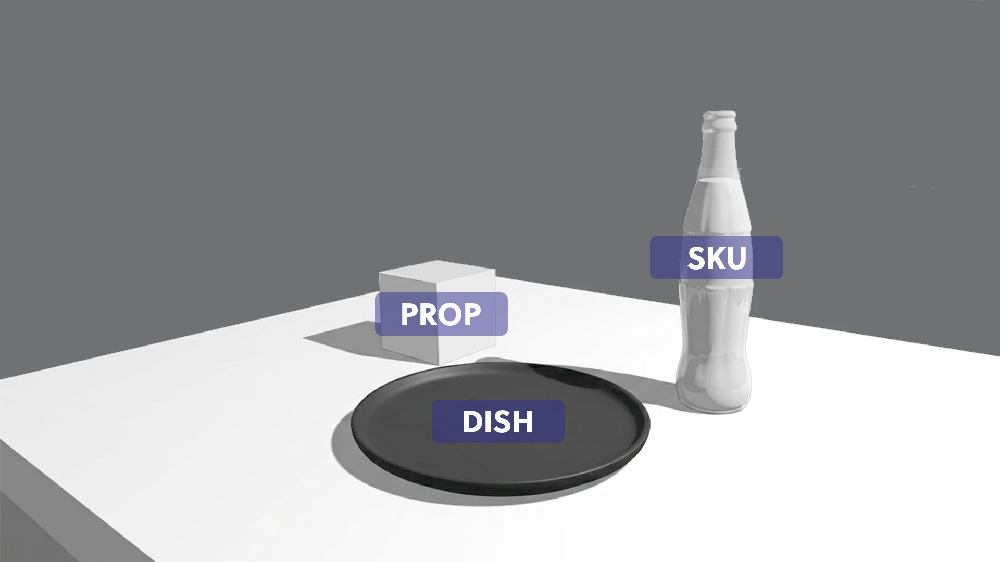
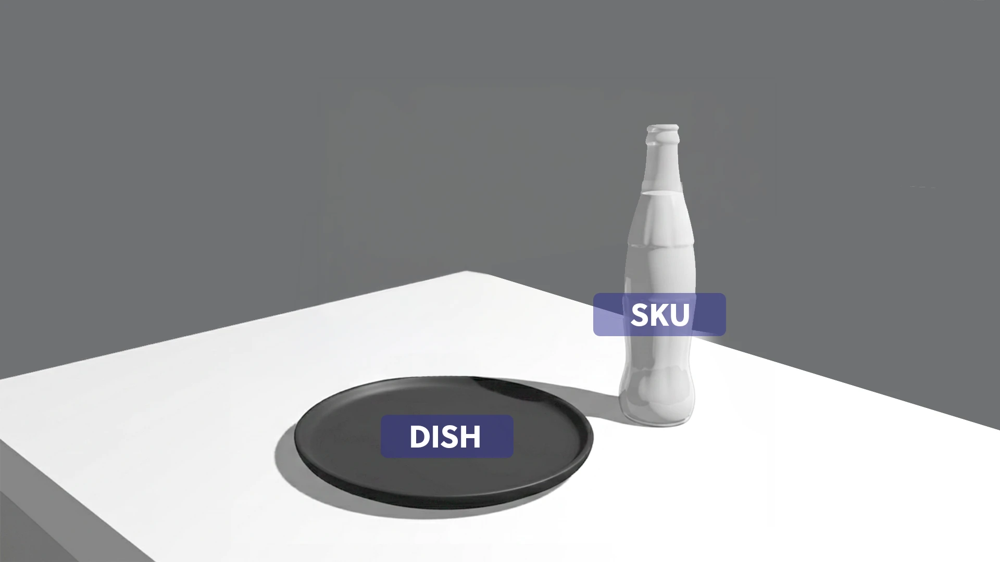
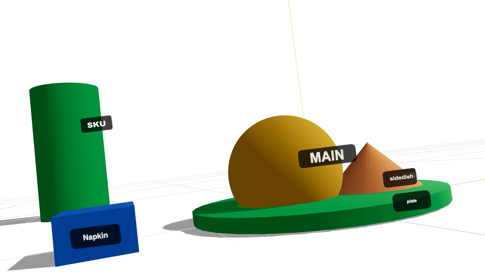
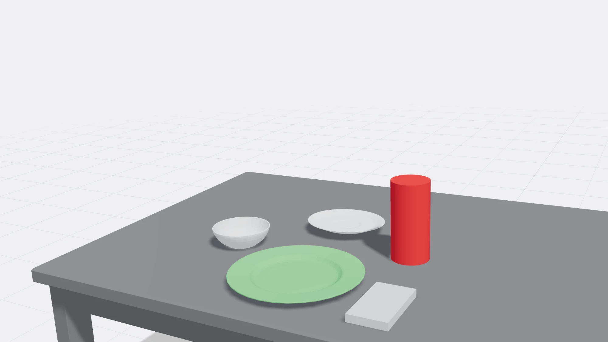

# Tablescape Composer — Plan

Turn the Cultural Prompt Agent's scene guidance (table type, entree, number of accompaniments, SKU, camera angle and lens) into a **labeled 3D perspective proxy** of the tablescape. The composer generates **up to 3 layout options** that use the same elements and meet the same requirements. The user picks one, so nobody has to design a layout by hand. Once a layout has been picked for a given combination of elements and camera, it becomes the template and is reused.

Reference proxies we're aiming for: [`reference/`](./reference)

| | |
|---|---|
|  |  |
|  |  |

---

## 0. Guiding principles

1. **The LLM decides *what* is on the table. Deterministic code decides *where* it goes.** The Prompt Agent outputs a semantic `SceneSpec`, and a rule-based solver turns it into geometry. The same input always gives the same options.
2. **Choose, don't design.** Users never place objects. They see up to 3 finished, rule-compliant proxies and pick one. That pick is the only human input and also the approval signal.
3. **Batch job, not an app.** Nobody watches the layout come together, so there is no interactive editor in the pipeline: spec in → solve → one render per option → images out.
4. **Rules come from data, not taste.** Design standards, brand rules and real object sizes live in versioned files, so every option is compliant by construction.

```
Prompt Agent ──► SceneSpec ──► signature ──► approved template? ──yes──► cached proxy (no solve, no render)
                                                  │ no
                                                  ▼
                                   Solver: one best layout per archetype
                                   (design rules + brand rules + known sizes)
                                                  │
                                   Pick up to 3 distinct, compliant options
                                                  │
                                   Headless render ×N  ──► options bundle (labeled + clean PNG, masks, layout JSON)
                                                  │
                                   User selects 1 ──► promoted to template for this signature
                                                  │
                                                  ▼
                                   Selected proxy + manifest ──► image generation workflow
```

---

## 1. Contract first (`SceneSpec`)

The agent's output format is still WIP, so **the schema is the first deliverable**. It lets the agent and composer tracks move in parallel, and the composer can be built against hand-written fixtures.

```jsonc
{
  "specVersion": "0.1",
  "market": "MX",
  "arrangementStyle": "individual-plated",   // individual-plated | family-style | banchan-grid | street-food
  "table":  { "shape": "rect", "surface": "wood", "size": "2-top" },
  "sku":    { "id": "coke-classic-8oz-glass", "package": "contour-glass-bottle" },
  "entree": { "name": "tacos al pastor", "vessel": "plate", "sizeClass": "L" },
  "accompaniments": [
    { "role": "sauce", "vessel": "small-bowl", "sizeClass": "S" },
    { "role": "side",  "vessel": "bowl",       "sizeClass": "M" }
  ],
  "props":  [ { "role": "napkin" } ],
  "camera": { "preset": "three-quarter-45", "focalLengthMm": 50, "aspect": "16:9" },
  "options": { "max": 3 }
}
```

Tasks:
- JSON Schema (or Zod/Pydantic) plus ~20 fixture specs covering markets and edge cases.
- A **closed vocabulary** for `vessel`, `package`, `role`, `camera.preset` and `arrangementStyle`. The agent maps free text such as "molcajete of salsa" onto `vessel: small-bowl, role: sauce` and keeps the free text for the image prompt.
- Stable **role labels** (`SKU`, `MAIN`, `SIDE_1`, `SAUCE_1`, `PROP_1`). The labels in the proxy, the ID mask and the final prompt manifest use the same strings, so regional prompts map 1:1.

## 2. Rule sources (what every option must obey)

Three versioned data files drive the solver. Every option is checked against all three, and changing a rule never needs a code change.

| file | owns | examples |
|---|---|---|
| `registry/*.json`: **known sizes** | real-world dimensions (m), footprint, height, bottom-center pivot, label anchor | 8 oz contour bottle Ø 6.2 cm × 19.5 cm; dinner plate Ø 27 cm; 2-top table 75 × 75 cm |
| `rules/brand.json`: **brand rules** | non-negotiables for the SKU | SKU ≤ 5 % occluded, never cropped, upright, logo yawed to camera; SKU height 35–55 % of frame; allowed SKU sides; min distance from frame edge |
| `rules/design.json`: **design standards** | composition quality | rule of thirds, visual balance, depth order (tall behind short), spacing ≥ 1.5 cm, no tangents, even negative space, table-edge handling per preset |

The brand rules are the **hard gate**: an option that fails one is never shown. Design standards are a mix of hard limits (overlap, table margins) and scored preferences (thirds, balance), weighted in `design.json`.

## 3. Real-scale proxy registry

- Every proxy has real dimensions and a **bottom-center pivot**, so objects sit on the tabletop without guessed spawn heights.
- SKU proxies per package, built with `LatheGeometry` from real profiles (the contour silhouette matters, see example 1): contour glass 8 / 12 oz, can 12 oz, PET 500 ml, glass with ice. Swap in GLBs later.
- Vessels (dinner plate, side plate, bowl, sauce bowl, board, basket, tray) and tables (rect / round / square, real sizes).
- Optional food-mass proxies (sphere / cone, as in example 3) so a heaped entree has its real silhouette height.
- **Proxies render with one flat, consistent color per role** under fixed lighting, not realistic materials. The image model is the only real viewer, so consistency beats looks.

## 4. Camera model

Each preset is **photographic parameters**, not a fixed position. The preset is part of the locked requirements, so all options share it.

| preset | elevation | azimuth | default lens |
|---|---|---|---|
| `eye-level` | 5–10° | 0° | 85 mm |
| `three-quarter-45` | 30–45° | ±25° | 50 mm |
| `high-angle` | 60° | 0–20° | 35 mm |
| `overhead` | 90° | 0° | 35 mm |

- `fov = 2·atan(24 / (2·focal))` (full-frame vertical), with aspect from the spec.
- **Auto-fit per option:** elevation, azimuth and lens stay locked. Only camera distance and aim point are solved, so the must-see set (SKU + MAIN + accompaniments) fills the frame at the target coverage within safe margins.

## 5. Layout solver

Work in **camera-relative table coordinates**: `x` = screen left↔right and `z` = depth away from the camera, on the tabletop plane. The same rules then apply at any azimuth, and results are rotated into world space at the end.

### 5a. Hard constraints (reject)
- Footprints don't overlap (gap ≥ 1.5 cm), everything stays on the table with an edge margin, and object counts match the spec exactly.
- All brand rules in `brand.json` (SKU visibility, cropping, orientation, prominence range).
- MAIN ≤ 15 % occluded and never cropped.

### 5b. Soft score (screen space)
Project each object's 3D bounding box through the camera to 2D (pure math, no rendering), then score:

| term | intent |
|---|---|
| `skuProminence` | SKU height near the brand target within its range |
| `heroArea` | MAIN is the largest 2D area |
| `thirds` | SKU and MAIN centroids near rule-of-thirds lines / intersections |
| `balance` | visual-weight centroid near frame center |
| `depthOrder` | tall objects behind short ones relative to camera |
| `breathingRoom` | even negative space, no tangents between objects or with the frame edge |
| `occlusionSoft` | accompaniments overlapping each other > 20 % is penalized |
| `tableEdge` | table front edge handled consistently per preset (examples 1–2) |

`score = Σ wᵢ·termᵢ`, with weights in `design.json`.

### 5c. Composition archetypes

An archetype is a named slot map: where MAIN, SKU, accompaniments and props may go, in normalized table coordinates. Each archetype is a recognizable composition idea, so the options differ in a way people can see.

| archetype | idea | MAIN | SKU | accompaniments |
|---|---|---|---|---|
| **Classic** | calm, centered hero | center / lower-left third | right third, beside and slightly behind MAIN | back arc |
| **Diagonal** | leading line toward the SKU | foreground left | mid-depth right | back right, continuing the diagonal |
| **SKU Forward** | brand-led, drink shares the hero | center-right, pushed back slightly | front-right, beside MAIN | back left, balancing the SKU |
| **Counterweight** | accompaniments grouped as one mass | center | right third | clustered on the left as a counterweight |
| **Mirrored** *(if brand allows SKU left)* | Classic flipped | center / lower-right third | left third | back arc |

Arrangement styles bring their own archetype sets (for example family-style: *Shared Center*, *Offset Share*; banchan-grid: *Grid Back*, *Grid Wrap*). This is also where cultural modules plug in: a market can enable, disable or reorder archetypes.

### 5d. Search (per archetype)
1. Enumerate slot assignments within the archetype (small: usually < 200 combinations).
2. Reject on hard constraints, then score.
3. Refine the top-k with a small **seeded** jitter pass (position ± 3 cm, yaw of non-SKU items) and keep improvements.
4. Auto-fit the camera, then re-score, since framing changes screen-space terms.
5. Keep the single best layout for this archetype, or mark the archetype infeasible.

If **no** archetype yields a valid layout, return an infeasible result with a relaxation suggestion (for example "max 3 accompaniments at close-up on a 2-top") to feed back to the agent.

## 6. Generating up to 3 options

### Locked across all options (the requirements)
- The same elements: SKU, entree, every accompaniment and prop, with the same vessels, sizes and counts.
- The same table, camera preset (elevation, azimuth, lens) and aspect ratio.
- The same brand rules and design limits. Every option passes every hard constraint.

### Allowed to vary
- Which archetype, and so which slot each element occupies.
- Exact x/z positions and the yaw of non-SKU items.
- Camera distance and aim point, via auto-fit only.

### Selection algorithm
1. Solve every archetype enabled for this arrangement style and market (5d).
2. Rank the feasible ones by score. Break ties with the market's archetype preference order and past selections (section 7).
3. Pick greedily down the ranking. Add a candidate only if it is **visibly different** from every option already picked:
   - it is a different archetype, **and**
   - the mean screen-space displacement of role centroids (SKU, MAIN, accompaniments) is ≥ 12 % of frame width, **or** the SKU and MAIN swap sides / depth order.
4. Stop at `options.max` (default 3).
5. **Never pad.** If only 1 or 2 distinct compliant layouts exist (a crowded small table, for example), return 1 or 2. A near-duplicate is worse than fewer choices.

### Options bundle

```
out/<runId>/
  options.json            # per option: archetype, score breakdown, one-line rationale, signature
  contact-sheet.png       # the options side by side with A / B / C badges, for the picker UI
  A/ labeled.png  clean.png  depth.png  ids.png  layout.json
  B/ ...
  C/ ...
```

Each option carries a short, generated **rationale** from its archetype and top score terms, for example *"Diagonal: leading line from entree to SKU; SKU at 48 % frame height"*. It gives the picker something to decide on besides taste.

### Picker
The user sees the contact sheet and picks A, B or C. Nothing else to do. Optional later: "show more" returns the next distinct archetypes if any remain.

## 7. Templates (reuse what was picked)

A **signature** is a key over everything that's locked:

```
rect-2top | three-quarter-45 | 50mm | 16:9 | sku:contour-8oz | main:plate | acc:sauce(small-bowl),side(bowl) | props:napkin | individual-plated | proxyset:v3
```

Lookup flow:
1. **Approved template exists** for the signature: return that cached proxy and layout directly, with **no solve and no render**. Optionally include the other cached options if the user asks to see alternatives.
2. **No approved template, but cached options exist**, from an earlier run whose options were never picked: return them again (deterministic, so identical).
3. **Near hit** (same except, say, one extra accompaniment): use the approved layout as the solver's starting point for its archetype, and solve the others normally.
4. **Miss:** full solve and render, then cache all options under the signature.

**Promotion:** the user's pick is the approval. The chosen option becomes the signature's approved template (versioned, with who picked it and when).

**Learning from picks:** count selections per archetype, by market and arrangement style. Over time this reorders archetype ranking (5c/6), so the most-picked composition shows up as option A. It's a small preference table, not a model.

**Invalidation:** `proxyset:vN` and the rules-file versions are part of the cache key. Changing a bottle profile, plate size, brand rule or weight invalidates old images automatically. Approved templates re-validate against the new rules and are flagged for a re-pick if they fail.

## 8. Rendering (headless, one frame per option)

- A small **`scene-core`** function, with no React and no render loop, turns `layout.json` into a three.js scene and renders one frame at the spec's aspect ratio. It runs in headless Chromium (Playwright) or Node with headless GL.
- **Labels are a 2D overlay** composited after rendering, from projected anchor points. They're always legible, never hidden behind objects, and all use one style (examples 1–3).
- Passes per option:
  1. **`labeled.png`**: for the picker, the prompt manifest and debugging.
  2. **`clean.png`**: no labels. **This is the one fed to the image model**, so the text "SKU" can't leak into the generated photo.
  3. **`depth.png`** and **`ids.png`** (flat color per role label): for depth / segmentation control and regional prompting, if the workflow accepts them.
  4. **`layout.json`**: signature, archetype, seed, camera parameters, and per-object `{label, role, world transform, 2D bbox, mask color}`, plus the full score and a pass/fail per rule.
- Because nobody watches the build, **validators are the quality gate.** Any hard-rule failure after rendering fails the run loudly, never quietly ships a frame.

## 9. Integration with the Cultural Prompt Agent

- A `tablescape` tool stage runs after the agent's scene guidance: `SceneSpec → options bundle → user pick → selected proxy attached to the prompt manifest`.
- **Pre-gen validator:** feasibility (5d). If infeasible, the agent revises counts or camera before anything is rendered.
- **Knowledge base hooks:** cultural modules set `arrangementStyle`, enable or disable archetypes, and reorder archetype preference per market.
- **Post-gen validator:** compare the generated image's detected SKU bbox with the selected layout's SKU bbox (IoU threshold) to catch drift.
- The **selected proxy and layout are stored with the final image** as the record of what was decided.

## 10. What to reuse from `wpp-scene-composer`

| Keep | Drop from the pipeline / change |
|---|---|
| Lighting + shadow setup (`Canvas3D.jsx`) → moves into `scene-core` | React canvas, render loop, resize handling, raycast selection |
| Geometry builders (`objectGeometries.js`) → become the registry | Scales aren't real-world (plate is 0.8 m across on a 2 m table), and pivots are centered (hence `spawnHeight 0.85`). Switch to meters and bottom pivots |
| Object model `{id, type, category, label, position, rotation, scale}` | Add `role` and `slot`, and make `label` the canonical role label |
| Camera preset list (`CameraPresets.jsx`) | Presets become elevation / azimuth / lens + auto-fit, with no tween animation |
| Aspect ratios offered | Aspect comes from the spec and drives the renderer directly |
| — | TransformGizmo, CategoryPicker, LayersPanel, LOAD/SAVE/EXPORT UI: not needed. The composer can stay as an **optional debug viewer** that opens a `layout.json` |

## 11. Module layout

```
tablescape/
  schema/        SceneSpec, Layout, Options, Template JSON schemas + fixtures
  registry/      known sizes: real-scale proxies (lathe profiles, vessels, tables)
  rules/         brand.json, design.json, archetypes/*.json (slot maps per arrangement style)
  camera/        preset → camera params, auto-fit
  solver/        constraints, scoring, per-archetype search, option selection + diversity
  templates/     signature(), lookup, cache, approvals, selection counts
  render/        scene-core (three.js), label overlay, depth / ID passes, contact sheet, headless runner
  cli/           `tablescape options spec.json --out ./out`
                 `tablescape select <runId> B`
```

The solver only needs projection and bounding-box math, so all of it is unit-testable without WebGL.

## 12. Phased roadmap

| Phase | Deliverable | Done when |
|---|---|---|
| **0: Contract + rules** | `SceneSpec` schema and fixtures; registry with real sizes incl. contour bottle; first `brand.json` / `design.json` signed off by brand + AD | Agent and composer teams both code against it |
| **1: Render from JSON** | `scene-core` + headless runner + label overlay: hand-written `layout.json` → labeled / clean PNG | Example 2 reproduced from JSON alone |
| **2: Solver, one option** | Constraints, scoring, camera auto-fit, *Classic* archetype for `individual-plated` | Every fixture gives a compliant layout or a clear infeasible result, deterministic per seed |
| **3: Three options** | Remaining archetypes, diversity selection, options bundle + contact sheet, rationale text | Fixtures return up to 3 visibly distinct, all-compliant options; never pads |
| **4: Pick → template** | Signature cache, selection = approval, template lookup bypasses solve + render, selection counts reorder archetypes | Repeat specs return the approved proxy instantly |
| **5: Pipeline hookup** | Agent tool stage, feasibility feedback, clean / depth / ID passes into the image workflow, post-gen SKU IoU | End-to-end: agent → options → pick → final image |
| **6: Scale out** | Family-style, banchan-grid, street-food archetype sets; per-market archetype preferences | Template hit rate and option-A pick rate tracked |

## 13. Testing and quality

- **Golden tests:** fixture spec → options snapshot (archetypes, layouts, scores) → rendered PNG diff in CI.
- **Rule tests:** one unit test per brand and design rule (SKU occlusion, crop, prominence, overlap, tangents).
- **Diversity tests:** options from a single spec always pass the distinctness check. Crowded fixtures return fewer than 3 rather than near-duplicates.
- **Metrics:** template hit rate, pick distribution per archetype (A picked most often means ranking works), and the rate of "none of these" if we add that button.

## 14. Open questions for the team

1. **SKU side:** is SKU-left allowed (which enables *Mirrored*)? Globally, per market, or per campaign?
2. **Image workflow inputs:** does the node-based workflow accept depth / segmentation / region masks, or only a reference image plus prompt? This decides which passes in section 8 we build first.
3. **Label semantics:** role labels (`SKU`, `MAIN`) or content labels (`Coke 8oz`, `tacos al pastor`) in `labeled.png`? Recommendation: role in the image, content in the manifest.
4. **Who picks:** the prompt operator, an AD, or the client? This affects whether picks should be scoped per user, per campaign or global.
5. **Is a pick enough approval** to promote a template, or should the final generated image also be approved first?
6. **SKU prominence range** per camera preset: the most brand-sensitive number in `brand.json`.
7. **Where it lives:** recommendation is a standalone `tablescape/` package in this repo, with `wpp-scene-composer` kept only as an optional debug viewer.
