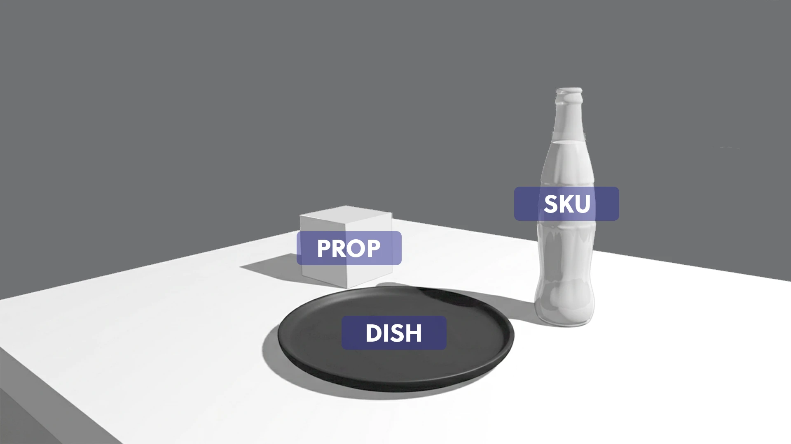
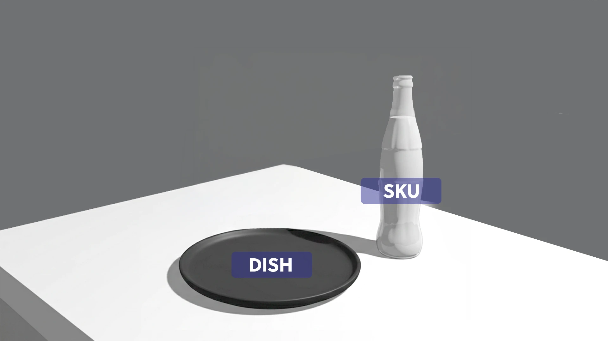
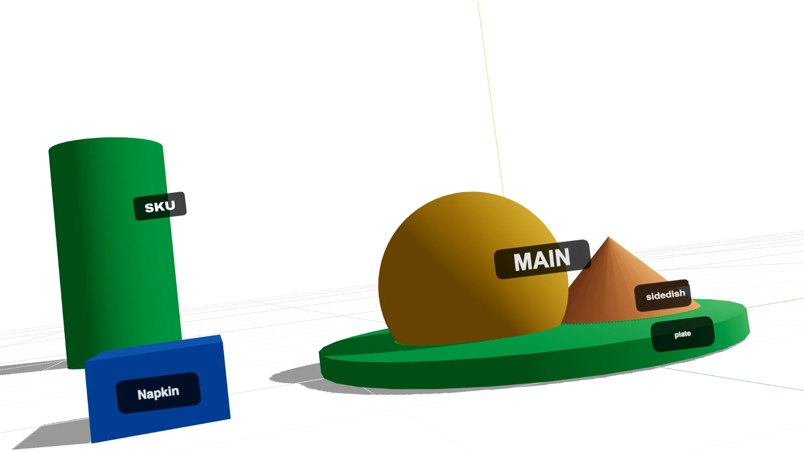
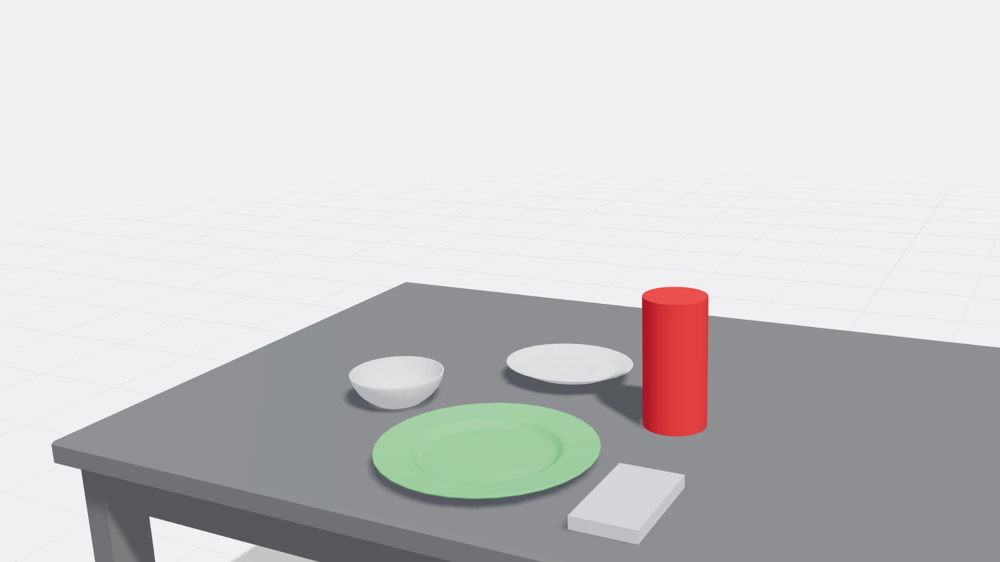

# Tablescape Composer — Plan

Turn the Cultural Prompt Agent's scene guidance into a **labeled 3D perspective proxy** of the tablescape that follows the CokeMeals composition rules:
- camera lens and angle chosen from dropdowns (default: 30° diner's eye)
- table horizon at or below 50 % of the frame (the bottle may rise above it)
- the main entree and SKU as co-heroes
- 50 / 30 / 20 visual mass across the three layers (tighter crop when there are no sides)
- odd item counts that form depth triangles

The composer generates **up to 3 layout options** that use the same elements and meet the same requirements. The prompt operator, who is also the art director, picks one, so nobody has to design a layout by hand. Once a layout has been picked for a given combination of elements and format, it becomes the template and is reused.

Related docs:
- [`../INTAKE_FLOW.md`](../INTAKE_FLOW.md): the front-end exchange that produces the `SceneSpec` this composer consumes.
- [`source/composition-rules.md`](./source/composition-rules.md) and [`source/blueprint.schema.json`](./source/blueprint.schema.json): the composition rules and blueprint schema as provided. Section 13 traces every rule to where it's implemented.
- [`reference/`](./reference): earlier proxy examples. These predate the composition rules: their camera is higher and their table horizon sits above 50 %.

| | |
|---|---|
|  |  |
|  |  |

---

## 0. Guiding principles

1. **The LLM decides *what* is on the table. Deterministic code decides *where* it goes.** The composition rules were written as a system prompt for an LLM that outputs coordinates (Part B). We keep every rule, but **the solver implements them in code, and the solver outputs the blueprint JSON (Part A)**. The LLM keeps the parts it's good at:
   - assigning each item to a layer
   - choosing the culturally right accent when the odd/even rule adds one
   - pairing each condiment with its dish

   Why not let the LLM place things:
   - An LLM can't check projection, occlusion or the horizon clamp.
   - It gives different coordinates for the same brief.
   - It can't guarantee 3 distinct options that all comply.
2. **Choose, don't design.** The operator never places objects. They see up to 3 finished, rule-compliant proxies and pick one. That pick is the approval.
3. **SKU always on the diner's right.** It's a fixed brand rule (2a), and it matches the composition rule placing the beverage midground-right.
4. **Batch job, not an app.** Nobody watches the layout come together: spec in → solve → one render per option → images out.
5. **Rules come from data, not taste.** Composition rules, brand rules and real object sizes live in versioned files, so every option is compliant by construction.

```
Intake flow (../INTAKE_FLOW.md) ──► SceneSpec
                                       │
                          Layer classification + odd/even check (agent picks the accent)
                                       │
                          signature ──► approved template? ──yes──► reuse blueprint (no solve) ──► render with this scene's lighting
                                       │ no
                                       ▼
                          Solver: one best layout per archetype
                          (composition rules + brand rules + known sizes)
                                       │
                          Pick up to 3 distinct, compliant options
                                       │
                          Headless render ×N ──► options bundle (labeled proxy for the model, review image, masks, blueprint.json)
                                       │
                          Operator selects 1 ──► promoted to template for this signature
                                       │
                                       ▼
                          Selected proxy + blueprint + prompt manifest ──► image generation workflow
```

---

## 1. Contracts

### 1a. Input: `SceneSpec`
Produced by the intake flow. The full field list and an example are in [`../INTAKE_FLOW.md`](../INTAKE_FLOW.md#resulting-scenespec-example). What the composer relies on:

| field | used for |
|---|---|
| *(no format fields)* | every template renders at **16:9**; ShRED ratios are cropped down in post (4b) |
| `camera.look`, `camera.angle` | plain-language presets → hidden lens, aperture, focus and pitch; prompt sentences |
| `scene.time` (+ setting, venue) | lighting preset → prompt sentence + proxy light rig |
| `scene.{setting, venue, party, surface}` | surface type and size (table, park table, bench, food-truck counter…), number of place settings, environment prompt |
| `sku.package`, `sku.volumeMl` | beverage proxy, logo box |
| `sku.glass` (Y/N; locked Y for SKUs of 1 L and up, hidden N on the go) | adds a branded bell glass to every place setting |
| `entree.{vessel, massClass}` | main proxy footprint and silhouette height |
| `accompaniments[]` with `role`, `vessel`, `pairsWith` | layer assignment, condiment proximity |
| `props[]` (napkin set: napkin shape + cutlery on top, with `targets`) | one Layer 3 prop, directional vectors |

- **Closed vocabularies** for `vessel`, `role`, `package`, `massClass`. The agent maps free text such as "molcajete of salsa" onto `vessel: small-bowl, role: sauce` and keeps the free text for the prompt.
- **Stable role labels** (`SKU`, `GLASS`, `MAIN`, `SIDE_1`, `SHARED_HERO`, `SHARED_1`, `SAUCE_1`, `ACCENT_1`, `NAPKIN_SET_1`). The same strings are used in the proxy labels, the ID mask, the blueprint `id` and the prompt manifest. **The image model relies on this match:** it reads the label on each shape to know which prompt segment applies to it (section 8a).
- `camera.{lens, angle}` are dropdown ids from [`camera-options.json`](./camera-options.json) (section 4a).

### 1b. Output: `blueprint.json` (Part A schema + extensions)
Every option's layout is emitted as a `CokeMeals3DTablescapeBlueprint` ([schema](./source/blueprint.schema.json)). It's the shared format between the composer, template cache, renderer and prompt manifest. The extensions below are allowed because the schema doesn't forbid extra properties. We should fold them into schema v2:

| extension | why it's needed |
|---|---|
| `frame.units` `{ x_span_m, z_span_m }` | links normalized coordinates to meters, needed for the 1–3 inch condiment rule and real sizes |
| `primitives[].role`, `primitives[].pairs_with` | role labels; which dish a condiment belongs to |
| `primitives[].screen_bbox` `{x0, y0, x1, y1}` | projected silhouette, for the horizon, occlusion and trademark checks |
| `primitives[].logo_bbox` (beverage only) | trademark clear zone check |
| `primitives[].footprint: "rect" \| "triangle"` (napkins) | folded napkins are rectangular or triangular; `bounding_box` alone can't express the triangle |
| `primitives[].group` | ties the cutlery to the napkin it rests on, so the set counts, labels and moves as one item |
| `primitives[].injected: true` + `injected_reason` | marks the accent added by the odd/even rule |
| `layout_meta` `{ archetype, seed, score, rule_results[], signature }` | traceability and template cache |

## 2. Rule sources

Three versioned data files drive the solver. Changing a rule never needs a code change.

| file | owns | contents (from the composition rules) |
|---|---|---|
| `registry/*.json`: **known sizes** | real dimensions (m), footprint, height, bottom-center pivot, logo box, label anchor | 8 oz contour bottle Ø 6.2 × 19.5 cm; dinner plate Ø 27 cm; ramekin Ø 7 cm; 2-top 75 × 75 cm… |
| `rules/brand.json`: **brand rules** | non-negotiables for the SKU | SKU on the diner's right; head-on to the camera; trademark clear zone; "Coca" script fully visible and in frame; upright |
| `rules/composition.json`: **composition rules** | CokeMeals layout rules | default camera 30°; horizon ≤ 0.50; depth bands; phi-grid anchors; 50/30/20 mass; odd/even; condiment 1–3 in; cutlery vectors; no line-of-sight stacking; side size 40–60 % |

**Hard** rules reject an option and are never relaxed. **Soft** rules are scored, with weights in `composition.json`. Section 13 lists which is which.

### 2a. SKU placement: always on the diner's right
- The SKU sits to the **right of MAIN, on the diner's right-hand side**, in every market. This avoids cultural problems where use of the left hand while dining is discouraged. It also matches the composition rule: beverage in the midground-right, over the upper-right phi intersection.
- **The diner's right is defined from each diner's seat**, not from the screen. For one diner, the camera shoots from that diner's side, so their right is always **screen-right**.
- **Hard constraint (1 person):** the SKU centroid is right of MAIN's centroid and inside the right half of the frame. It targets the right phi line (x = +0.236).
- **Hard constraint (2 people):** each SKU is on its own diner's right in table coordinates, measured from that diner's seat. Depending on where they sit, that can be in front of, behind or screen-left of their plate (5.6).
- There's no per-country override.
- **The SKU is the only drink shown**, in every scene and for every diner (v1). No other beverages, glasses of water or competitor products.
- **SKU size, venue and glass rules** ([`glass-rules.json`](./glass-rules.json)):

  | venue | SKU under 1 L | SKU 1 L and up (large, shared) |
  |---|---|---|
  | home | glass optional (intake Y/N) | **one shared bottle for the table, glass required** |
  | restaurant | glass optional (intake Y/N) | **not allowed** |
  | on the go | **no glass** | **not allowed** |

  - **Large SKUs (1 L and up) are shared:** one bottle for the table, placed in the center third between the place settings, never one bottle per diner.
  - **Large SKUs appear only at home**, never at restaurants or on the go. The intake enforces this in both directions.
  - **Glasses never appear on the go.** The glass question is hidden there.
  - **Large SKUs (1 L and up) require a glass**, because diners pour from the shared bottle: the question is answered Y and locked. Otherwise the operator decides (default N).
  - Whenever glasses are in the scene, **every place setting gets one**.
- **When the glass is present** (label `GLASS`), it sits **beside the bottle, on the MAIN side**, slightly forward of it. It's close to the meal, in the center third, on the diner's right, and it never covers the bottle's logo box. Both logos face the camera head-on, and the trademark clear zone (H5) and head-on rule (H6) apply to both. In 2-person scenes each diner gets one.
- **When it's absent**, the bottle is the only logo'd element, and every rule below that mentions the glass simply skips it.

## 3. Real-scale proxy registry

- Every proxy has real dimensions and a **bottom-center pivot**, so objects sit on the tabletop without guessed spawn heights. The blueprint's shape types map onto the registry: `cylinder` (beverages, glasses), `flattened_cylinder` (plates, bowls, ramekins), `bounding_box` (cutlery, boards, baskets, foil wraps, napkins with a rectangular or triangular footprint).
- **Beverages:** contour glass 8 / 12 oz, can 12 oz, PET 500 ml, and the **large shared SKUs, home only** (for example PET 1 L, 1.5 L, 2 L and larger glass bottles; a 2 L bottle is ~33 cm tall, so it rises well into the upper half). Plus the **branded bell-shaped Coca-Cola glass** (lathe profile from the real glass; dimensions to confirm, roughly 15–16 cm tall with a ~9 cm rim), poured with cola, with or without ice. They're built with `LatheGeometry` from real profiles, and each has a **logo box** (the "Coca" script region) for the trademark clear zone.
- **Plating vessels** cover every option the intake's plating step can offer: plate, bowl, board, basket, foil wrap, tray, leaf, paper-lined basket. A plating with no proxy maps to the nearest class.
- **Food-mass proxies** per `massClass` (flat, heaped, stacked, wrapped) give the entree its real silhouette height. This matters for occlusion and the tight-crop framing.
- **Props:** ramekins, sauce boats, lime dish, and the **napkin set**: a folded napkin (rectangle or triangle) with cutlery resting on top, treated as one item.
- **Proxies render with one flat color per layer or role** under fixed lighting. The image model is the only real viewer, so consistency beats looks.

## 4. Camera and frame

### 4a. Camera: plain-language presets

Most operators won't know what an aperture does, so they never see one. They pick from two dropdowns, both defined in [`camera-options.json`](./camera-options.json):

| dropdown | options | behind each option (hidden) |
|---|---|---|
| **Look** | *Close-up hero* (default) · *Table in context* · *Wide scene* | lens, aperture, focus target and focus distance, bundled |
| **Angle** | *Low, near eye level* · *Diner's eye* (default) · *Looking down* | camera pitch |

Each option has a one-line help text for the UI ("Tight on the meal and the bottle, background melts away"), a prompt sentence, and the hidden technical values the proxy camera uses. The proxy must use the same lens and angle the prompt describes.

**The technical values are still placeholders** (provisional 50 / 35 / 15 mm and 15° / 30° / 45°, aperture TBD) while the team settles the lenses. The labels and structure are final, so everything downstream can be built now. Swapping in the final values is a data change only.

**Guidelines for writing the final presets** (from the first draft, in git history at commit `1520fc2`):
- **One value per option, not a range**, because the proxy camera needs one number and it must match the prompt.
- **Every look names what's sharp: "the main dish and the Coca-Cola bottle".** Fast apertures keep only a few centimeters in focus (50 mm f/2.8 ≈ 6–9 cm), less than the 20–30 cm between entree and bottle. This protects the "Coca in focus" rule without the operator knowing anything about apertures.
- **Describe depth of field accurately,** and keep genre ("street food photography") out of the look. Genre comes from the scene.
- **Exclude 0° and 90°,** per the composition rules.

**How the choices affect the layout:**
- **Focal length** sets the proxy's field of view, `fov = 2·atan(24 / (2·f))`.
- A **fixed focus distance** fixes the camera's distance from MAIN, so auto-fit only adjusts the aim.
- *Wide scene* stretches objects near the frame edges, so the SKU stays out of the outer 15 %.
- *Low* angles make items hide behind each other more, so fewer items fit.
- **Azimuth** is 0° ± 10°, always from the diner's side.
- **Aperture is prompt-only.** Look and angle are part of the template signature.

### 4b. Frame zones

```
y = 1.0 ┌───────────────────────────────────────────┐
        │  ENVIRONMENT / CONTEXT ZONE    ▲ bottle   │  bokeh environment from scene details (prompt-only)
        │                          ● SKU │ may rise │  y≈0.618: upper-right phi (SKU logo / upper body)
y = 0.5 ├ ─ ─ ─ ─ ─ table rear edge ≤ here ─ ─ ─ ─ ─┤
        │  TABLE SUBSTRATE ZONE          ▮ base    │  table surface + every item's base live here
        │  ● MAIN (lower-left phi, y ≤ 0.382)       │
y = 0.0 └───────────────────────────────────────────┘
```

- **Auto-fit:** the chosen pitch and lens stay locked, as does the azimuth. Camera distance, height and aim point are solved so that:
  - the table's rear edge projects at y ≤ 0.50 (target 0.44–0.50, which uses the table zone fully)
  - every item's base (its contact with the table) and every low item stays in the table zone. **Tall items, the bottle above all, may rise into the upper half.** The table surface itself never does.
  - MAIN and the SKU land near their phi anchors
  - **meal + SKU only (no Layer 2): crop in tighter.** The coverage target rises, so the co-heroes fill the frame, while the horizon clamp still holds.
- **Aspect ratio: always 16:9.** Every template and proxy is composed and rendered at 16:9. ShRED ratios are **cropped down in post**, so there's one template per layout, not one per ratio. The blueprint schema's ratio list doesn't include 16:9, so `canvas_metadata.aspect_ratio` gets `"16:9"` added as an extension.
- **Crop protection: hero meal + SKU (+ glass, when present) in the vertical center third.** The goal: **every crop contains at least one complete logo'd element (the bottle, or the branded glass when present) plus part of the meal.** To get that, the solver keeps the hero MAIN, SKU and GLASS (if any) in the center third of the 16:9 frame (x 0.333–0.667 of the width). This fits the rest of the rules: the phi anchors (MAIN at 0.382, SKU at 0.618) sit inside the center third, and sides and accents fill the outer thirds.

  **Priority crops** (v1). Every one is narrower than 16:9, so each keeps the **full height** and a slice of the width. The horizon rule survives every crop, and the post crop window can slide left or right:

  | crop | keeps of the 16:9 width | result with the hero group in the center third |
  |---|---|---|
  | **16:9** (master) | 100 % | everything |
  | 3:2 | 84 % | the whole center third, plus most of the outer thirds |
  | 5:4 | 70 % | the whole center third, plus part of each outer third |
  | 1:1 | 56 % | the whole center third, plus part of each outer third |
  | 4:5 | 45 % | the whole center third, plus a little either side |
  | 2:3 | 37.5 % | the whole center third just fits: full meal, bottle and glass (if present) |
  | **9:16** | **31.6 %** | **the tightest crop, slightly narrower than the center third (33.3 %).** Sliding the window to the SKU side always keeps the full bottle (and glass, if present) plus most of the meal. If the hero group spans ≤ 31 % of the width (soft target `heroSpan`), 9:16 holds all of it |

  Other ShRED ratios (1:3, 3:1) are deprioritized for now.
- **ShRED, first pass:** we follow the primary ShRED cropping preferences in post, which already take the copy areas into account. There's no copy block or text placement in v1: the focus is image quality.

### 4c. Lighting: derived from the scene, never picked

Lighting follows from where and when the meal happens, so the operator doesn't choose it. **Scene details (setting, venue) + time of day** select one preset from [`lighting-presets.json`](./lighting-presets.json). The result is shown in the meal summary ("Lighting: natural window daylight, because this is a meal at home in the morning").

**Time of day** comes from the occasion when that's unambiguous (breakfast → morning, dinner → evening). Otherwise it's one extra choice in the scene step: morning · midday · golden hour · evening.

| scene | morning / midday | golden hour | evening |
|---|---|---|---|
| Indoor · home | window daylight, soft, neutral 5500 K | low golden sun through the window, long warm shadows | warm pendant + table lamp, 2700 K, cozy pools of light |
| Indoor · restaurant | bright interior, soft window light | (same as day) | warm ambient fixtures + table candle, background bokeh |
| Outdoor · any | morning: low soft sun · midday: **open shade** (umbrella or tree), because hard noon sun gives black shadows and blown glass highlights | warm low sun, long soft shadows | home/restaurant: string lights against blue dusk · on the go: food-stall lamp, city lights |

**Each preset drives both the prompt and the proxy:**
- a **prompt sentence** that describes the light source, its direction, the shadows and the color temperature
- a **light rig** for the proxy renderer: key light type, direction, elevation, color temperature, softness and fill ratio, plus practical lights such as lamps and string lights. The proxy's shadows then point the same way as the prompt's light. If the proxy is used as a reference image, mismatched shadows would fight the prompt.

**One direction rule for every preset: the key light comes from behind-left of the table.** The SKU is always right of MAIN, so this direction:
1. passes light **through (glass, PET) or along (can) the SKU toward the camera**, which gives the cola its red-amber glow and the contour its highlights
2. throws shadows **forward-right, away from the entree**, so the bottle's shadow never falls across the main dish

**Light through the SKU depends on the package** (`sku_light` in the presets file):
- **Glass or PET:** a glow sentence matched to the preset's warmth, for example "Light passes through the Coca-Cola bottle from behind, giving the cola a deep red-amber glow with crisp highlights along the contour glass."
- **Can:** light can't pass through, so the sentence asks for a clean rim highlight and a well-lit logo instead.

**Shadow checks** (hard rule H13, checked on a shadow pass of the proxy render):
- no cast shadow crosses the SKU logo box
- the SKU's shadow doesn't fall on MAIN
- shadow direction matches the preset

**Lighting is not part of the template.** A template is the layout: positions, camera and framing. Lighting is applied on top at render time, so the same approved layout serves breakfast at home and dinner at a restaurant.
- The blueprint stores no lighting. The lighting preset is chosen per run from the scene and passed to the renderer separately.
- Reusing a template under a new lighting preset means **one re-render and a re-run of H13 only**. The layout isn't solved again.
- **The light adapts to the layout, never the other way round.** If a lighting preset's shadows break H13 on an approved layout (for example golden-hour shadows long enough to reach the entree), the renderer adjusts the key light within the preset's allowed range: rotate it within the behind-left sector, or raise it slightly to shorten shadows. The positions never move.
- If no adjustment passes, the run reports it rather than silently changing the layout. This should be rare, since every preset keeps the key light behind-left.

## 5. Layout solver

### 5.1 Coordinate frame
The blueprint's normalized frame is defined as follows:
- **x ∈ [-1, 1]:** lateral position across the table. -1 is left, +1 is right (the diner's right).
- **z ∈ [0, 1]:** depth. 0 is the immediate foreground at the bottom of the frame, **0.5 is the table's rear edge (the horizon)**, and 1 is far background.
- **y ∈ [0, 0.50]:** the primitive center's **projected height on the canvas**, from the bottom. The solver derives it from x/z and the camera. It's used to check the clamp, not to place objects.

The solver works in meters internally (real sizes, the 1–3 inch rule) and converts to the normalized frame for output, recording the scale in `frame.units`.

Depth bands (from the rules):

| band | z | holds |
|---|---|---|
| immediate foreground | 0.0–0.2 | MAIN only |
| midground | 0.2–0.4 | SKU + Layer 2 sides |
| rear table margin | 0.4–0.5 | Layer 3 accents only, if needed |
| background | > 0.5 | never table elements (environment, prompt-only) |

### 5.2 Pre-step: layers and the odd/even engine
1. **Classify** every item into a layer. The agent does this with the closed role vocabulary:
   - **Layer 1, Primary Co-Heroes:** MAIN + SKU (bottle), plus GLASS when the glass rule applies (2a).
   - **Layer 2, Secondary:** sides, starches, salads, sharing bowls, bread baskets, and **shared serving vessels** in family-style meals (5.6).
   - **Layer 3, Tertiary:** ramekins, sauces, garnishes, and the napkin set (napkin + the cutlery on top of it).
2. **Count N** = MAIN + SKU + Layer 2 + ramekins / sauces / garnishes + napkin set. **Napkin and cutlery count as one item**, since the cutlery nearly always rests on the napkin.
3. **If N is even:** the solver requests one Layer 3 accent. The **agent picks what it is** from the country's knowledge base (lime dish, pickled onions, kimchi, chutney ramekin…) and falls back to a plain ramekin. The accent is marked `injected: true` and shown in the meal summary as "added for composition", where the operator can swap it.
4. **Side-size check** (Part B, Layer 2: "scale primitives 40%–60% smaller than the main entree"): proposed reading is that each side vessel's diameter is 40–60 % of the MAIN vessel's diameter. That matches real dishware: a 12–16 cm side bowl next to a 27 cm plate. Real sizes are never rescaled. A side outside the range triggers a warning at the sides step, never a rejected layout.

### 5.3 Hard constraints (reject the option)

| # | rule | check |
|---|---|---|
| H1 | Horizon clamp | table rear edge projects at y ≤ 0.50 |
| H2 | Table zone | every item's base (table contact) is at y ≤ 0.50, and low items (plates, bowls, ramekins, napkin set) sit fully below it. Tall items, especially the SKU, may extend above 0.50 |
| H3 | Depth bands | MAIN z ∈ [0, 0.2]; SKU and Layer 2 z ∈ [0.2, 0.4]; Layer 3 z ≤ 0.5 |
| H4 | SKU right | SKU x > MAIN x, SKU in the right half |
| H5 | Trademark clear zone | nothing overlaps the SKU's `logo_bbox` + margin in screen space; the "Coca" script is fully in frame |
| H6 | SKU head-on | the SKU faces the camera head-on, logo centered (yaw 0° relative to the camera, ± 3°), upright (roll and pitch 0) |
| H7 | No line-of-sight stacking | a nearer item may cover at most 30 % of the width of an item directly behind it; sides are never directly behind MAIN |
| H8 | Condiment proximity | edge-to-edge gap to the `pairs_with` dish is 2.5–7.6 cm (1–3 in) |
| H9 | Cutlery vectors | cutlery rests on its napkin; the handle→tip axis points within ±15° of its target's center; no handle points toward the frame edge; fully in frame |
| H10 | Odd count | N (after the odd/even step) is odd |
| H11 | Physical | footprints don't overlap (gap ≥ 1.5 cm, except condiments meant to sit on their dish); everything on the table |
| H12 | Co-heroes visible | MAIN ≤ 15 % occluded and not cropped at the sides |
| H13 | Shadows | no cast shadow crosses the logo box; the SKU's shadow doesn't fall on MAIN; shadow direction matches the lighting preset (4c). Checked per render, because lighting isn't part of the layout |
| H14 | Center third | the full silhouettes of the SKU and the GLASS (if present) sit inside the vertical center third of the frame (x 0.333–0.667), and MAIN's visual center is inside it too. This guarantees the crop goal for every priority crop, including 9:16 |

### 5.4 Soft score (screen space)
Each primitive is projected through the camera: analytic silhouettes for the solver, and the ID pass for the final check. The score terms:

| term | intent (source rule) |
|---|---|
| `phiAnchors` | full-canvas phi grid: MAIN's visual center near the lower-left phi point (x -0.236, at or below y 0.382); the SKU on the right phi line (x +0.236), with its logo and upper body rising toward the upper-right phi point (y ≈ 0.618) |
| `goldenTriangle` | MAIN → SKU sits along the golden-triangle diagonal |
| `visualMass` | projected area share per layer is close to 50 / 30 / 20 (± 5 pts, measured on `ids.png`) **when all three layers are present**. Source: the composition rules' layer weights (Part B, citing Visual Brand Guidelines [1]; also the blueprint schema's `visual_mass_distribution`). **It's a soft target, not a hard rule:** it only affects ranking, never rejects a layout, and its weight is set per archetype in `composition.json` (lowered or zeroed for edge cases). For meal + SKU only (plus any injected accent), the split is skipped and the tight-crop framing applies instead |
| `depthTriangles` | odd groups form real triangles in x–z (no three items in a line), per the depth-loop rule |
| `lateralStagger` | midground items staggered diagonally or laterally behind MAIN |
| `napkinPlacement` | the napkin set sits in a natural place-setting position (beside MAIN, typically front-left), square or at a slight angle to the table edge |
| `leadingLines` | the cutlery on the napkin leads the eye toward MAIN or the SKU |
| `breathingRoom` | even negative space, no tangents between objects or with the frame edge |
| `heroSpan` | the hero group (MAIN + SKU, plus GLASS if present) spans ≤ 31 % of frame width, so even a 9:16 crop holds all of it |
| `horizonUse` | the table rear edge is close to 0.50, using the table zone fully |

`score = Σ wᵢ·termᵢ`, with weights in `composition.json`.

### 5.5 Archetypes
The co-heroes are anchored by the rules (MAIN front-left, SKU mid-right), so the archetypes vary **how the Layer 2 and 3 items sit around them**. Each archetype is a named slot map in the normalized frame.

| archetype | idea | Layer 2 / 3 placement | default when |
|---|---|---|---|
| **Triangle Loop** | depth loop MAIN → SKU → accent | accent / side at far-left midground; more items build nested triangles | N = 3 (the rules' 2 + 1 case) |
| **Crescent Arc** | secondaries wrap behind MAIN | 3+ items in a midground arc from left to center, behind MAIN | N = 5 (the rules' 4 + 1 case) |
| **Diagonal Stagger** | leading line into the SKU | items stepped along a diagonal from front-left toward the SKU | N ≥ 5 alternative |
| **Counterweight** | mass balances the SKU | secondaries grouped mid-left, opposite the SKU | N ≥ 5 alternative |
| **Feast Spread** | family-style table, one plated setting | one shared hero back-left; shared sides in a back arc and flanks across the outer thirds | shared-vessel meals (5.6) |

Napkin shape (rectangle or triangle) and cutlery target (MAIN or SKU) are variants within an archetype. Arrangement styles for group and family scenes bring their own archetype sets (open question 4). A market can reorder archetypes but not break any rule.

### 5.6 Surfaces and place settings

**On-the-go scenes always have a surface.** Food is never shown in a hand. The surface is a scene choice, suggested by the agent from the country's knowledge base (decision card, A suggested):

| surface | registry proxy | effect on layout |
|---|---|---|
| dining table (home, restaurant) | 2-top / 4-top / long table | full depth bands |
| park or picnic table | wide, shallow-front picnic table | full depth bands |
| bench | bench seat, ~35–40 cm deep | little depth: items spread **laterally**, fewer fit, mostly 1 setting |
| food-truck counter / street ledge | counter or ledge, ~30–40 cm deep, standing height | little depth: lateral layout, camera looks slightly up or level at the counter edge |

The horizon rule applies to the rear edge of whatever surface it is. Narrow surfaces fit fewer items, and the solver reports "infeasible, suggest ≤ N items" rather than stacking.

**Every diner gets the same place setting** (v1): the same main, the same SKU, the same sides, condiments and napkin set. The SKU is every diner's drink.

**2 people: two arrangements.** Both are offered as layout archetypes, so the operator's options can include either. Diagrams are top-down, with the camera at the bottom:

**Corner (catty-corner).** The two diners sit around one corner of the table, on adjacent sides, 90° apart.
```
   back of table
  ┌─────────────────────────────┐
  │                   SKU_2 ●   │   diner 2 sits on the right side, facing left.
  │                  (MAIN_2)   │ ◄ Their right hand points away from the camera,
  │   ◆ ACCENT      SKU ●  ▭N2  │   so SKU_2 sits behind their plate.
  │  (MAIN)   ▭N                │
  └─────────────────────────────┘
      ▲ diner 1 (hero)              📷 camera on diner 1's side
```
- **Diner 1 (hero)** is on the camera side and follows every rule in this plan: MAIN front-left, SKU mid-right, both in the center third. Diner 2's setting sits in the right third and may be cropped away in narrow crops.
- **Diner 2 sits on the right-hand side of the table**, facing left, with MAIN_2 at mid-depth on the right. Their right hand points away from the camera, so **SKU_2 sits behind their plate**, clear of everything.
- Diner 2 goes on the right, not the left. Seated on the left side, their right hand would point toward the camera, which puts SKU_2 in the foreground in front of their plate, crowding the hero's entree.
- Diner 2's napkin set is on their left, which here is the camera side of their plate.
- Diner 2's items count as **Layer 2 mass**. Their labels are `MAIN_2`, `SKU_2`, `NAPKIN_SET_2`…, each matched to a prompt segment that says "same as MAIN" and so on.

**Face-to-face, left and right.** The diners sit at the left and right ends of the table, facing each other. The camera looks at the long side where no one sits, so **both settings share the same depth**: neither is foreground, neither is background.
```
   back of table
  ┌─────────────────────────────┐
  │                  SKU_R ●    │   right diner faces left: their right hand
  │ ▭NL                         │   points away → SKU_R behind, toward center
  │►(MAIN_L)   ◆ ACCENT  (MAIN_R)◄
  │         ● SKU_L          ▭NR│   left diner faces right: their right hand
  └─────────────────────────────┘   points at the camera → SKU_L in front, toward center
                 📷 camera on the long side, no diner there
```
- The two MAINs sit left and right at the same depth (z ≈ 0.2–0.3), near the left and right phi lines. **There's no single hero**: both settings are Layer 1 and share the 50 % co-hero mass.
- **Each SKU is on its own diner's right, toward the table center.** For the left diner that's in front of their plate (screen-right of it). For the right diner it's behind their plate (screen-left of it). The two bottles form a **diagonal through the frame center**, one forward and one back, so they never block each other and read as a leading line.
- Napkin sets are on each diner's left: behind the left plate, in front of the right plate.
- **Rule adaptations for this arrangement:** MAINs sit at the front/mid boundary instead of the immediate foreground, and SKU_L sits forward of the usual 0.2–0.4 SKU band. The horizon, stacking, clear-zone and shadow rules all still apply.
- **Crop protection:** the two SKUs (and their glasses, if present) sit near the center, so they stay inside the center third (H14). Each MAIN's inner edge reaches into it, which gives every crop a full logo'd element plus part of a meal. The outer edges of the plates may be trimmed in 1:1 and narrower crops.

**For both arrangements:**
- Every diner has **the same place setting**, and the SKU is every diner's drink.
- **Odd/even:** two identical settings always make an even count, so the added accent becomes a **shared item between the two settings** (a shared salsa or lime dish). It sits at the corner (Corner) or the table center (Face-to-face), never in front of either SKU.
- Lighting stays key-from-behind-left. In Face-to-face, SKU_L's shadow falls forward-right, toward the table center and away from both plates.

**Shared-vessel meal, one place setting** (for example a Thanksgiving feast). The food is served family-style on the table, and **one place setting is shown with a portion plated from it**, plus a glass. A large shared SKU fits this naturally: one shared bottle, one glass.
```
   back of table
  ┌──────────────────────────────────────┐
  │ (SHARED_1)  [ SHARED_HERO ]          │   one large shared hero: turkey, roast, pizza
  │      (SHARED_2)            SKU ●     │   shared sides fill the outer thirds
  │               GLASS ◯    (SHARED_3)  │
  │        (MAIN)   ▭N                   │   MAIN = the plated portion for one
  └──────────────────────────────────────┘
      outer third |  center third  | outer third
```
**What's on the table:**
- **Exactly one shared hero vessel** (`SHARED_HERO`): the large centerpiece the meal is built around, such as a whole turkey on a platter, a roast on a board, or a pizza.
- **Shared sides** (`SHARED_1`, `SHARED_2`…): bowls, casseroles, a bread basket or board. Up to **4 vessels**, limited by a **size budget of 4 units**, because bowl size matters more than the count. **These values are starting points to test, not final**: family-style scenes are edge cases for now.

  | shared side | size | units |
  |---|---|---|
  | small bowl | under 15 cm | 0.5 |
  | medium bowl | 15–22 cm | 1 |
  | large bowl, casserole | 23 cm and up | 2 |
  | bread basket or board | any | 1 |

  So 4 medium bowls fit, as do 2 large bowls, or 1 casserole + 1 bread basket + 1 medium bowl. The intake's sides step shows the budget as sides are picked and blocks going over it.
- **The place setting:** the plated portion (MAIN), the shared bottle (SKU), one glass and the napkin set.

**Where things go:**
- **Hero group = MAIN + SKU + GLASS** in the center third (H14). All existing rules apply to them unchanged, including crop protection.
- **The shared hero sits in the back band (z ≈ 0.3–0.45), left of center,** opposite the bottle and offset from the plate so it's never directly behind it (H7). It overlaps the left edge of the center third, so it survives the 1:1 and 4:5 crops and is partly visible in 9:16.
- **Shared sides** are Layer 2 in a staggered back arc and the flanks, filling the outer thirds. They can be partly cropped at the frame edges, and a narrow crop may cut them away while keeping the hero group.
- **Visual mass:** the 50 / 30 / 20 target is **relaxed for Feast Spread** (low weight in `composition.json`), since a large shared centerpiece is an edge case the split wasn't written for. What matters is that the hero group (plate + bottle + glass) stays clearly dominant through placement: foreground and center third. Shared sides count as secondary (Layer 2). Shared vessels are exempt from the 40–60 % side-size rule.
- **Prompt:** the MAIN segment describes a portion of the shared food (for example "a plate with sliced turkey, stuffing and cranberry sauce"). `SHARED_HERO` and each `SHARED_n` segment describe the vessel and its food.
- Odd/even counts every shared vessel. The no-stacking, clear-zone and shadow rules apply as usual, so no vessel sits in front of the bottle or glass.
- **Archetype: Feast Spread.** Shared hero back-left, sides in the arc and flanks, hero group in the center third. Variants change which sides flank left or right and how far they're cropped.

**Groups and families** (proposed): the hero setting follows the rules, and the neighbouring settings are identical and partly cropped at the frame edges. Shared dishes sit in the center of the table. Full group layouts stay in Phase 6.

### 5.7 Search (per archetype)
1. Place the co-heroes near their phi anchors, then enumerate slot assignments for Layer 2 and 3 (small: usually < 200 combinations).
2. Auto-fit the camera, then reject on hard constraints.
3. Score, and refine the top-k with a **seeded** jitter pass (positions ± 3 cm, non-SKU yaw, napkin-set angle).
4. Keep the best layout for the archetype, or mark the archetype infeasible.

If no archetype is feasible, return an infeasible result with a relaxation suggestion, such as "a bench fits at most 3 items" or "drop one side", to feed back to the intake.

## 6. Generating up to 3 options

**Locked across options:**
- elements, vessels and counts, including the injected accent
- the 16:9 frame
- surface and number of place settings
- camera lens and angle (the operator's dropdown choices)
- every hard rule

**Allowed to vary:**
- archetype and slot assignment
- Layer 2 and 3 positions, napkin shape and cutlery target
- small co-hero shifts around their phi anchors
- camera distance and aim, via auto-fit

**Selection:**
1. Solve every enabled archetype (5.7).
2. Rank by score. Break ties with past picks for this market (section 7).
3. Pick greedily. An option is added only if it's a different archetype **and** its Layer 2 and 3 role centroids move ≥ 10 % of frame width on average versus every option already picked. Co-heroes are anchored, so they don't count toward difference.
4. Stop at 3. **Never pad.** Small scenes have fewer ways to comply: N = 3 (main + SKU + accent) is nearly prescribed by the rules, so expect 1–2 options there, and 3 for N ≥ 5.

**Bundle:**
```
out/<runId>/
  options.json            # per option: archetype, score breakdown, rule results, one-line rationale
  contact-sheet.png       # A / B / C side by side for the operator's pick
  A/ proxy.png  review.png  depth.png  ids.png  blueprint.json
  B/ …
  C/ …
```
Each option has a one-line rationale, for example *"Crescent Arc: sides wrap behind the tacos; knife on the napkin leads to the bottle; mass 51/29/20"*.

## 7. Templates (reuse what was picked)

A **template is the layout**: primitive positions, rotations, camera look and angle, and framing. A **signature** is a key over everything that shapes that layout. Lighting is deliberately **not** in it (see 4c):
```
close-hero | diners-eye | surface:table-2top | settings:1 | sku:contour-8oz | glass:N | main:plate(flat) | L2:bowl | L3:small-bowl,accent:small-bowl | props:napkin-set(rect) | proxyset:v3 | rules:v2
```

**Lookup:**
1. **Approved template exists:** reuse its blueprint with no solve. Render it once with this run's lighting preset (fast, and the render is cached per template + lighting preset), then re-check H13.
2. **Cached options exist but none was picked:** return them again.
3. **Near hit** (one item different): seed the solver from the approved layout.
4. **Miss:** full solve, then cache.

**Promotion and upkeep:**
- **Promotion:** the operator's pick is the approval and becomes the signature's template (versioned, with who picked it and when).
- **Retire:** if final images from a template keep disappointing, the operator retires it. The next run shows fresh options, excluding it.
- **Learning:** pick counts per archetype, by market and scene, reorder the ranking.
- **Invalidation:** `proxyset` and `rules` versions are in the key. Any change to a size or rule re-validates approved templates and flags failures for a re-pick.

## 8. Rendering and outputs (headless, one frame per option)

- A small **`scene-core`** function, with no React and no render loop, takes `blueprint.json` **plus the run's lighting preset** (the blueprint holds no lighting), turns them into a three.js scene and renders one frame at the spec's aspect ratio. It runs in headless Chromium (Playwright) or Node with headless GL.
- Passes per option:
  1. **`proxy.png`**: the shapes with their **role labels. This is what the image model gets.** The model reads each label to match the shape to its prompt segment (8a). It contains shapes and labels only: no horizon line, copy-reserve blocks or other guides, because the model would try to render them.
  2. **`review.png`**: `proxy.png` plus the horizon line and rule results, for the operator's pick and debugging.
  3. **`depth.png`** and **`ids.png`** (flat color per role): for depth / segmentation control and regional prompting, if the workflow supports them. `ids.png` also measures visual mass exactly.
  4. **`blueprint.json`**: Part A plus extensions, including every rule's pass/fail result.
### 8a. Labels as the link between shapes and prompt

The labels in `proxy.png` are functional, not decoration. The image generator uses them to decide which prompt segment applies to which shape, so they're designed for the model to read:
- **Label text = prompt segment key, exactly.** The prompt is written in segments keyed by the same role labels, for example `MAIN: tacos al pastor on a white plate…`, `SKU: an ice-cold 8 oz Coca-Cola contour glass bottle…`, `SAUCE_1: salsa verde in a small clay bowl…`. The prompt builder generates both from the blueprint, so they can't drift apart. Every labeled shape has a segment, and every segment has a labeled shape.
- **Role labels on the image, content in the prompt.** Labels stay short and constant (`SIDE_1`, not "frijoles charros"), so the proxy is reusable across meals with the same layout and the model isn't handed long text to copy.
- **On the shape, on its visible part.** Each label is centered inside the visible silhouette of its own shape, never floating between two shapes. It's placed on the unoccluded portion when something partly covers the shape.
- **Small items:** when a shape is too small to hold a legible label (a ramekin in a wide shot), the label sits just outside it with a short leader line. The solver checks that it can't be read as belonging to a neighbour.
- **SKU label on the lower body,** below the logo box, so the label doesn't sit where the "Coca" script will be generated.
- **One style everywhere:** same font, high contrast, a fixed minimum size relative to the frame, and no overlap between labels. The label box is checked like any other primitive: labels may not cover each other or another shape's label.
- **Keeping labels out of the final image.** Because the model sees text, it may reproduce it. The prompt includes a fixed line saying the labels are placement guides and not to render them as text, and the post-gen validator runs text detection for any role label appearing in the output (section 9).

- **Validators are the quality gate.** Hard rules are re-checked on the rendered ID mask. A failure fails the run loudly and never ships a frame.
- **Prompt-only rules** travel in the prompt manifest, not the proxy:
  - aperture / depth of field and focus target (the look preset's prompt sentence)
  - lighting and the light through the SKU (the lighting preset's sentences; the proxy only mirrors the direction)
  - environment and bokeh content for the upper zone
  - ≤ 2.5 background faces
  - the "Coca" script slanting diagonally upward, which is inherent to an upright bottle facing the camera

## 9. Integration with the Cultural Prompt Agent

- **Intake flow → `SceneSpec`** ([`../INTAKE_FLOW.md`](../INTAKE_FLOW.md)). The layout pick is the flow's last decision step and uses the same A (suggested) / B / C card as the meal steps.
- **Agent responsibilities in the composer:** layer classification, the accent choice for the odd/even rule, and `pairsWith` links.
- **Feasibility feedback:** infeasible results go back to the sides or scene step with a concrete suggestion.
- **Knowledge scope:** the Operating Unit owns the rules (brand, legal, SKU catalog). Cultural knowledge is **per country** for now. It may later be clustered by OU, but v1 looks it up by country code.
- **Post-gen validators:**
  - the SKU's detected box matches the blueprint's SKU box (IoU)
  - the table horizon in the generated image is ≤ 0.50
  - the logo isn't covered
  - the face count in the background is within the rule
  - no role label text (`SKU`, `MAIN`, `SIDE_1`…) appears in the generated image
  - each labeled shape became the item its prompt segment describes (for example the `SIDE_1` position holds the side dish, not the sauce)
- The **selected proxy and blueprint are stored with the final image** as the record of what was decided.

## 10. What to reuse from `wpp-scene-composer`

| Keep | Drop from the pipeline / change |
|---|---|
| Lighting + shadow setup (`Canvas3D.jsx`) → `scene-core` | React canvas, render loop, resize handling, raycast selection |
| Geometry builders (`objectGeometries.js`) → registry | Scales aren't real-world (plate is 0.8 m across on a 2 m table), and pivots are centered (hence `spawnHeight 0.85`). Switch to meters, bottom pivots and the blueprint shape types |
| Object model `{id, type, category, label, position, rotation, scale}` | Replace with blueprint primitives (`layer`, `role`, `shape_type`…) |
| Aspect-ratio selector | Drop it: always 16:9, ShRED crops in post |
| — | CameraPresets (replaced by the dropdowns in `camera-options.json`), TransformGizmo, CategoryPicker, LayersPanel, LOAD/SAVE UI. The composer can stay as an **optional debug viewer** for `blueprint.json` |

## 11. Module layout

```
tablescape/
  schema/        SceneSpec, Blueprint (Part A + extensions), Options, Template schemas + fixtures
  registry/      known sizes: beverages (+ logo boxes), plating vessels, food-mass, props, tables
  rules/         brand.json (per OU), glass-rules.json (per OU), composition.json, archetypes/*.json,
                 camera-options.json, lighting-presets.json
  camera/        camera-options.json → proxy camera, auto-fit, horizon clamp
  solver/        layer + odd/even pre-step, constraints H1–H14, scoring, archetype search, option selection
  templates/     signature(), lookup, cache, approvals, pick counts
  render/        scene-core, proxy label placement, review overlay (horizon, rule results), depth + ID passes, contact sheet, headless runner
  cli/           `tablescape options spec.json --out ./out`
                 `tablescape select <runId> B`
```
The solver only needs projection and footprint math, so it's unit-testable without WebGL.

## 12. Phased roadmap

| Phase | Deliverable | Done when |
|---|---|---|
| **0: Contracts + rules** | `SceneSpec` v0.2 (from the intake flow), blueprint schema v2 (Part A + extensions), `brand.json` / `composition.json` from the composition rules and the team decisions (§15), open questions 1–3 answered | Agent, intake and composer all code against the same schemas |
| **1: Render from blueprint** | Registry at real scale; `scene-core` + headless runner + overlays: hand-written `blueprint.json` → labeled proxy / review / ID PNG | A hand-written N = 3 blueprint renders with the horizon at ≤ 0.50 |
| **2: Solver, one option** | Camera auto-fit, odd/even pre-step, H1–H14, scoring, *Triangle Loop* | Every N = 3 fixture passes all hard rules, deterministic per seed |
| **3: Three options** | *Crescent Arc*, *Diagonal Stagger*, *Counterweight*; diversity selection; bundle + contact sheet + rationale | N ≥ 5 fixtures return 3 distinct, compliant options; every option passes the crop test |
| **4: Pick → template** | Signature cache, pick = approval, template bypass, pick counts | Repeat specs return the approved proxy instantly |
| **5: Pipeline hookup** | Intake decision cards → SceneSpec → options → pick → manifest; post-gen validators | End-to-end run from intake to final image |
| **6: Scale out** | Group and family layouts, narrow surfaces (bench, counter) tuned, shopper-zone copy and text placement | Template hit rate and option-A pick rate tracked |

## 13. Rule traceability

| Source rule | Implemented as | Where |
|---|---|---|
| ~30° diner's-eye camera; no overhead or hyper-low | 30° is the default angle; other angles offered via the dropdown (placeholders); 0° and 90° excluded | 4a (open question 10) |
| Table rear edge ≤ Y 0.50 | **H1** + auto-fit | 4b, 5.3 |
| All table items in the lower 50 % | **H2**: bases and low items; **team decision:** the bottle may rise into the upper half | 5.3 |
| Upper 50 % for bokeh + ShRED copy | environment is prompt-only; **team decision:** follow ShRED crops, no text placement in v1 | 4b, 8 |
| MAIN at Z 0–0.2; beverage + sides at Z 0.2–0.4; nothing on the table at Z > 0.5 | **H3** | 5.1, 5.3 |
| MAIN at lower-left phi; beverage at upper-right phi / golden triangle | `phiAnchors`, `goldenTriangle` (full-canvas phi grid) | 5.4 |
| 50 / 30 / 20 visual mass | `visualMass` soft score when all layers are present; tighter crop otherwise | 4b, 5.4 |
| Sides 40–60 % smaller than MAIN | diameter 40–60 % of MAIN's (proposed); selection-time warning, never rescaled; shared serving vessels exempt | 5.2 (open question 3) |
| Stagger sides diagonally or laterally behind MAIN | `lateralStagger` + **H7** | 5.3, 5.4 |
| Don't stack along the line of sight | **H7** | 5.3 |
| Even N → inject +1 Layer 3 accent; form depth triangles | odd/even pre-step + **H10** + `depthTriangles`; Triangle Loop / Crescent Arc defaults | 5.2, 5.5 |
| Condiments within 1–3 in of their dish | **H8** (via `pairs_with`) | 5.3 |
| Cutlery points inward; never off-canvas | **H9** + `leadingLines` | 5.3, 5.4 |
| Napkin S- / C-curves through midground gaps | **team decision: dropped.** Napkins are rectangular or triangular, with cutlery on top; `napkinPlacement` | 3, 5.4 |
| Clockwise seam offset on bottles / cans | **team decision: dropped.** Bottles are shot head-on (**H6**) | 5.3 |
| Trademark clear zone; nothing overlaps the logo box | **H5** | 5.3 |
| "Coca" fully visible, in focus, slanting upward, even if tightly cropped | **H5** (in frame and uncovered); focus and slant are prompt-only | 5.3, 8 |
| f/4–f/5.6 depth of field | set per lens option (placeholders); every fragment names the entree and bottle as sharp | 4a (open question 10) |
| ≤ 2.5 faces in the background | prompt manifest + post-gen check | 8, 9 |
| SKU on the diner's right (our rule) | **H4** | 2a |
| Lighting from the scene; glow through the SKU; bottle shadow off the entree (our rule) | lighting preset + key light behind-left + **H13** | 4c |

## 14. Testing and quality

- **Golden tests:** fixture spec → options snapshot (archetypes, blueprints, scores) → PNG diff in CI.
- **Rule tests:** one unit test per hard rule, H1–H14. Every option from every fixture is asserted to pass all of them. A **crop test** cuts every priority crop (3:2, 5:4, 1:1, 4:5, 2:3, 9:16) from the 16:9 render, sliding the window, and asserts at least one crop position holds a complete logo'd element plus part of the meal.
- **Odd/even tests:** N = 2, 4, 6 inputs always gain exactly one accent. Odd inputs never do.
- **Diversity tests:** options from one spec always pass the distinctness check. Small scenes return fewer rather than near-duplicates.
- **Metrics:** template hit rate, pick distribution per archetype, visual-mass error, and post-gen SKU IoU.

## 15. Decisions and open questions

### Decided
- **Bottle height:** the bottle may rise into the upper half. The table surface and every item's base stay at or below 0.50 (H2). This also settles the phi grid: it applies to the **full canvas**, with the SKU rising toward the upper-right point (y ≈ 0.618).
- **Visual mass:** 50 / 30 / 20 applies when all three layers are present. Meal + SKU only → **crop in tighter** instead.
- **Odd/even count:** napkin + cutlery count as **one item** (the napkin set), since cutlery nearly always rests on the napkin.
- **Seam offset:** dropped. Bottles are shot **head-on** (H6), which keeps the seams out of view anyway.
- **Napkin curves:** dropped. Napkins are **rectangular or triangular** (folded).
- **ShRED:** follow the primary ShRED cropping preferences, which already allow for copy areas. **No text or copy placement in v1**; the focus is image quality.
- **Aspect ratio:** every template renders at **16:9**; ShRED ratios are cropped in post (4b, H14).
- **Crop protection:** hero meal + SKU (+ glass, when present) stay in the vertical center third, so every priority crop holds at least one complete logo'd element plus part of the meal (4b, H14).
- **Priority crops:** 16:9 (master), 1:1, 4:5, 2:3, 3:2, 5:4, 9:16.
- **SKU size, venue and glass:** SKUs of 1 L and up are shared (one bottle per table) and appear only at home. Glasses never appear on the go. SKUs of 1 L and up also require a glass (locked Y). Otherwise the operator's intake Y/N decides, and every place setting gets a glass when there are glasses (2a, `glass-rules.json`).
- **Large bottle, one setting:** allowed. For example, a family-style feast: one shared hero vessel (turkey, roast, pizza), shared sides up to 4 within a size budget, one place setting with a plated portion, the shared bottle and one glass (5.6, *Feast Spread*).
- **On the go:** always on a surface (park table, bench, food-truck counter…), never in a hand (5.6).
- **Drinks:** the SKU is the only drink, for every diner. Every diner has the same place setting (5.6).
- **Knowledge scope:** OU owns the rules; cultural knowledge is per country (9).
- **Labels:** role labels on the proxy, matching the prompt segment keys (8a).

### Open

Composition:

1. **Trademark clear zone margin:** how much clear space around the logo box? Proposed default: 10 % of the bottle's width on every side.
2. **Tight-crop target:** for meal + SKU only, how much of the frame should the co-heroes fill? Proposed default: the MAIN + SKU group spans ~70 % of the frame width. And should the odd/even rule still add an accent to these scenes (the rules say yes: 2 → 3)?
3. **Sides 40–60 %:** this comes from Part B, Layer 2 ("scale primitives 40%–60% smaller than the main entree", citing Visual Brand Guidelines [1]). Proposed reading: side vessel **diameter is 40–60 % of the entree vessel's diameter**, used as a warning when sides are picked. Confirm, or drop it if it isn't a real brand rule.
4. **2-person arrangements** (5.6): confirm the Corner layout with diner 2 on the right side of the table, and the Face-to-face layout with each SKU on its own diner's right (one in front of its plate, one behind). Should both always be offered, or should the agent pick one per country and scene?
5. **Feast Spread tuning (later):** the size-budget units and the visual-mass weight for family-style scenes get tuned through testing. They're edge cases for now.
6. **Does the glass count toward odd/even?** Proposed: yes, it's a separate object. With a glass, main + bottle + glass = 3 is already odd. Without it, main + bottle = 2 still gets the added accent.

Pipeline:

7. **Image workflow inputs:** besides the labeled proxy, does the workflow accept depth / segmentation masks?
8. **Label format:** does the workflow expect a specific label or segment syntax (for example `[MAIN]` or `MAIN:`)? `MAIN:` is assumed.
9. **Where it lives:** a standalone `tablescape/` package in this repo, with `wpp-scene-composer` as an optional debug viewer (recommended)?

Camera:

10. **Final values behind the camera presets** (*Close-up hero*, *Table in context*, *Wide scene*; the three angles): focal length, aperture, focus distance, pitch and prompt sentence. Also confirm the composition rules' ~30° and f/4–f/5.6 are **defaults** the presets can override.

Lighting:

11. **Lighting preset review.** `lighting-presets.json` is a draft: light sources, color temperatures, and the prompt wording per scene and time of day.
12. **Can the operator override the derived lighting?** Proposed: no in v1.
13. **Time of day:** confirm the occasion → time mapping, and that time of day is asked in the scene step when the occasion doesn't settle it.
14. **Region and climate:** should lighting vary by region? Proposed: not in v1.
